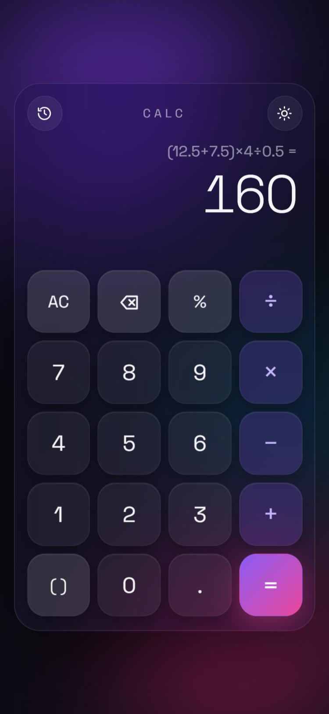

# Calculator

A calculator that shows the answer as you type, remembers your sums, works from the keyboard, and has a bit of 3D motion: the glass body tilts toward the pointer, keys ripple, and results slide into place.

**Live:** https://calculator-six-iota-56.vercel.app



## Features

- Live answer under the sum while you type; `=` closes any open brackets for you.
- `+ − × ÷`, brackets (one smart `( )` key), negative numbers, and `%` that works like a phone calculator: `200 + 10%` is 220, `50 × 10%` is 5.
- No floating point noise: `0.1 + 0.2` shows `0.3`. Clear messages for mistakes such as dividing by zero.
- History drawer with your last 25 results; tap one to use it again.
- Keyboard: digits, `+ - * /`, `%`, `( )`, `Enter`, `Backspace`, `Esc`. Paste a sum with Ctrl+V; copy the answer with Ctrl+C or a click on it.
- Dark and light themes (the light one keeps the soft, raised keys of the original design), switched with a circular reveal.
- Respects `prefers-reduced-motion`; keys are labelled for screen readers and results are announced.

## How it works

The first version passed the display text to `eval()`. Now `src/engine.js` has a small tokenizer and recursive-descent parser, so typed or pasted text can only ever be arithmetic. It is plain ES modules with no build step:

| File | Job |
|---|---|
| `src/engine.js` | Tokenize, parse and evaluate; format results; live preview |
| `src/main.js` | Input rules, rendering, history, keyboard, clipboard, theme, tilt |
| `styles.css` | Glass, keys, motion |

## Run it

Serve the folder with any static server, for example:

```bash
npx serve .
```

Tests use Node's built-in runner (Node 20+):

```bash
npm test
```
